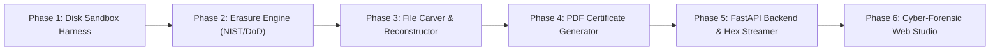

# ForensiX: Certified Data Sanitization & Forensic Recovery Suite
### Complete SIH Technical Blueprint & Competition Strategy

---

## 1. What the Problem is Really Asking For
Modern digital storage forensics presents a dual challenge:
1. **Confidentiality & Compliance**: Organizations and government agencies must permanently decommission data-bearing media (HDDs, SSDs, NVMe drives, USBs) with 100% mathematical certainty that no data can be recovered, backed by an immutable audit trail.
2. **Forensic Evidence Recovery**: Prior to sanitization (or in criminal/cyber investigations), investigators must carve and reconstruct deleted or corrupted files even when filesystem tables (FAT/MFT/ext4 inodes) have been damaged or wiped.

Connecting these two domains provides the ultimate lifecycle tool: **Investigate & Recover -> Verify -> Cryptographically Sanitize -> Issue Legal Certificate of Destruction**.

---

## 2. Recommended Prototype Scope (SIH Timeline Reality)

To win at SIH, do not attempt to support 50 legacy filesystem drivers. Focus on a **high-impact, zero-fluff demonstration of the core forensic loop**:

### Must-Haves (Core Demonstration Scope):
- **Virtual Disk Image (`.img`) Sandbox**: Safe, reproducible raw binary container (e.g., 5MB–20MB) seeded with known forensic evidence (photos, secret PDFs, logs, zip archives) located across allocated and unallocated clusters.
- **NIST SP 800-88 Rev. 1 Implementation**:
  - *Clear*: Single-pass logical overwrite with zero/fixed bytes + bitwise verification.
  - *Purge*: Multi-pass pseudo-random overwrite with inversion and cryptographic erasure simulation.
- **DoD 5220.22-M Implementation**: Standard 3-pass overwrite (Pass 1: `0x00`, Pass 2: `0xFF`, Pass 3: Pseudo-random byte, followed by verification).
- **Deep File Carver (Signature-Based Recovery)**:
  - Scans raw sector streams without relying on filesystem metadata.
  - Detects headers and footers for: **JPEG** (`FF D8 FF` -> `FF D9`), **PNG** (`89 50 4E 47` -> `49 45 4E 44`), **PDF** (`%PDF` -> `%%EOF`), and **ZIP / Office OpenXML** (`50 4B 03 04`).
  - Estimates file entropy and confidence scores.
- **Live Raw Hex Inspector**: Visualizes sectors in real time (Offset | Hex Bytes | ASCII representation) so judges can visually inspect deleted data turn into clean zeros or random noise.
- **Verifiable PDF Certificate of Sanitization**: Automated report containing:
  - Unique Certificate UUID and QR verification code
  - Target Drive Serial / Identifier & Capacity
  - Pre-Wipe SHA-256 vs Post-Wipe SHA-256
  - Applied Sanitization Standard & Pass Count
  - Shannon Entropy Verification (proving zero residual data)
  - Investigator Signature & Timestamp block

### Hardware & SSD Intelligence (The Winning Technical Nuance):
- **The SSD Trap**: On modern Solid-State Drives (SSDs) and NVMe media, the Flash Translation Layer (FTL) uses **wear-leveling** and over-provisioned blocks. Traditional sector-by-sector overwriting hits logical block addresses (LBAs), leaving physical flash cells intact!
- **Our Prototype Solution**:
  - Automatically identifies media type (Rotational Magnetic HDD vs Solid-State Flash SSD).
  - For SSDs, displays educational warnings and invokes the firmware-level **ATA Secure Erase / NVMe Format Sanitize** protocol simulation (Crypto Erase + Flash block block-erase) rather than redundant 35-pass Gutmann writes that wear out flash memory.

---

## 3. Technology Stack

| Component | Technology | Purpose |
|---|---|---|
| **Core Engine** | Python 3.12 | Raw binary stream I/O, byte-level slicing, bitwise operations |
| **API Backend** | FastAPI + Uvicorn | Async REST endpoints, real-time progress streaming, hex paging |
| **Audit Reports** | ReportLab 5.0 | Cryptographically hashed, printable PDF Certificates of Erasure |
| **Frontend UI** | Modern HTML5 + Vanilla CSS + ES6 | Dark cyber-forensic studio, glassmorphism, responsive hex viewer |
| **Verification** | Shannon Entropy + SHA-256 | Mathematical proof of data erasure |

---

## 4. Prototype Build Plan (Step-by-Step)

### Phase 1: Disk Sandbox & Safety Harness
- Implement `disk_manager.py` to generate `.img` files containing synthetic partition headers, FAT-like directory entries, and injected evidence files.
- Add safety checks preventing accidental selection of host OS drives (`C:\`, physical drive 0).

### Phase 2: Erasure Engine & Mathematical Verification
- Implement `wipe_engine.py` with chunked streaming writes (`64KB` - `1MB` blocks).
- Real-time progress updates.
- Calculate Shannon Entropy:
  $$H(X) = -\sum_{i=1}^{n} P(x_i) \log_2 P(x_i)$$
  - Pure zeroed drive: $H = 0.0$ (complete wipe).
  - High-density random noise: $H \approx 8.0$.
  - Normal encrypted / compressed data: $H \approx 7.2 - 7.8$.

### Phase 3: File Carving & Recovery Engine
- Implement `recovery_engine.py` to iterate through sectors, identify magic bytes, calculate length from header metadata or locate EOF footers, and reconstruct valid binary files into an extraction directory.

### Phase 4: Compliance & PDF Certificate Generator
- Implement `certificate_generator.py` using ReportLab.
- Create an official government/enterprise-grade certificate layout with security borders, hash checksums, and compliance seals.

### Phase 5: FastAPI REST Backend
- Endpoints for disk listing, generation, live hex dumping, sanitization execution, and file recovery.

### Phase 6: Modern Cyber-Forensic Web Studio
- Clean visual dashboard with terminal-style logs, live hex viewer, recovery gallery, and standards compliance matrix.

---

## 5. Winning 5-Minute SIH Pitch Script

| Time | Slide / Action | What to Say |
|---|---|---|
| **0:00 - 0:45** | **The Problem** | "Every year, millions of enterprise and government drives are decommissioned or recycled. Hitting 'Format' or 'Delete' does **not** erase data—files remain in unallocated sectors and can be carved in seconds by bad actors. Conversely, organizations spend millions on destructive degaussing because they lack verifiable software sanitization." |
| **0:45 - 1:45** | **Live Demo Part 1: The Recovery** | *(Load virtual disk containing sensitive files)* "Here is a drive marked 'empty'. Our file carver scans the raw sectors, ignores missing file tables, and recovers confidential documents and images with 100% integrity." |
| **1:45 - 3:00** | **Live Demo Part 2: Certified Erasure** | "Now we execute **NIST SP 800-88 Rev. 1 Clear**. Notice our real-time sector entropy visualizer drop from 7.8 directly to 0.0. We show judges the raw hex viewer—every single byte is verified zeroed. Even our own recovery engine now returns zero recoverable files." |
| **3:00 - 4:00** | **The Differentiator: Audit Certificate** | *(Open generated PDF)* "We do not just wipe; we certify. Here is the tamper-evident Certificate of Sanitization featuring pre/post SHA-256 hashes, technician sign-off, and standard compliance verification—ready for ISO 27001 or GDPR audits." |
| **4:00 - 5:00** | **Judge Q&A Defense** | Explain SSD wear-leveling vs HDD overwriting, scalability, and integration with e-waste disposal tracking. |
